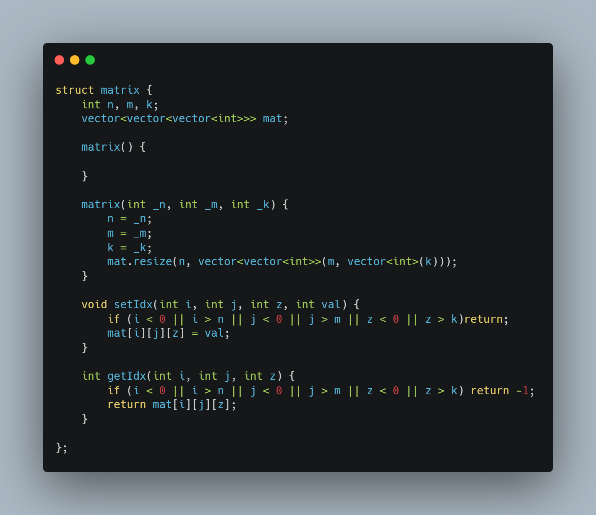
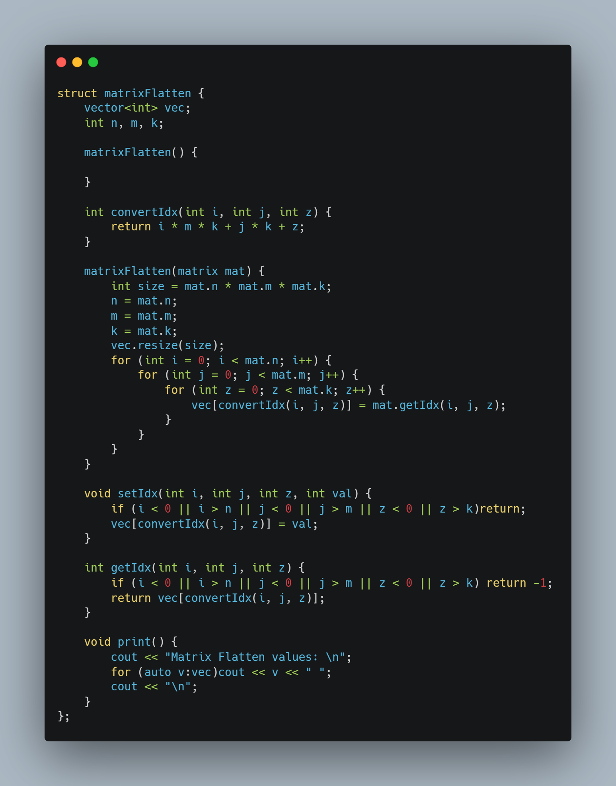
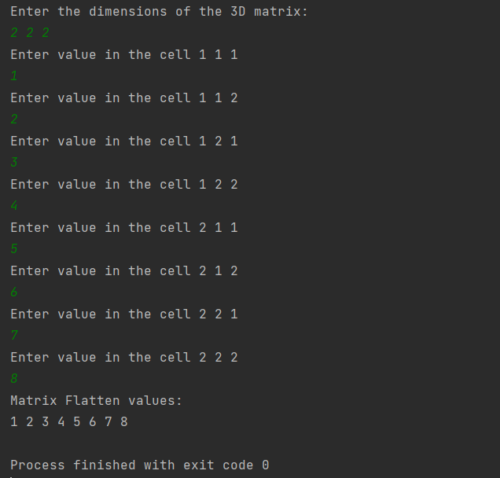

# Matrix-Flatten
Master Micro's task to test programming skills for summer internship applicants Task3

## 🏁 Get Started <a name = "Install"></a>

```
git clone https://github.com/gaserashraf/Matrix-Flatten.git
```
```
cd Matrix-Flatten
```
```
g++ source.cpp -o out
```
```
out
```
## 💻 Built Using <a name = "tech"></a>
- **C++**
## 📷 Screenshots

<div name="Screenshots" align="center">
   <h2 align='center'>Class Matrix</h2>
   </a>
   <hr>
  <h2 align='center'>Class Matrix Flatten</h2>
   </a>
   <hr>

   <h2 align='center'>sample exmaple test</h2>
   </a>
</div>


## ✨ Complexity
- *The complexity of the indexing from i,j,k to y is O(1)*
